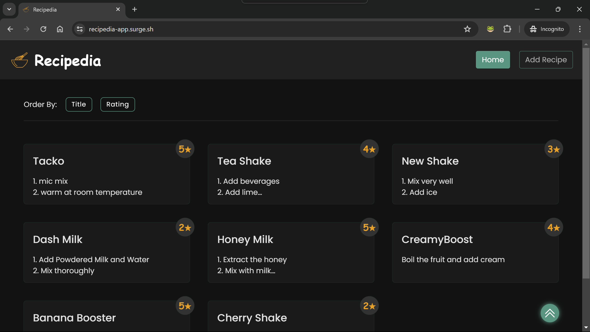

# Recipedia &middot; [![build-badge]][build]

[build-badge]: https://img.shields.io/github/actions/workflow/status/koscee/recipedia/ci.yml?label=build&logo=github
[build]: (https://github.com/koscee/recipedia/actions/workflows/ci.yml/badge.svg)

This is a simple online recipe manual. Visit the [Recipedia](https://recipedia-app.surge.sh/) website to view the live demo.



## Table of Contents

- [Features](#features)
- [Technologies](#technologies)
- [Getting Started](#getting-started)
  - [Prerequisites](#prerequisites)
  - [Installation](#installation)
- [ESLint Configuration](#eslint-configuration)
  - [Running ESLint](#running-eslint)
- [Contributing](#contributing)

## Features

- Add, edit, and delete recipes
- View recipe details
- View recipe instructions
- Search for recipes `upcoming feature`
- Filter recipes by category `upcoming feature`
- View recipe ingredients `upcoming feature`
- View recipe nutrition facts `upcoming feature`
- View recipe reviews `upcoming feature`

## Technologies

- [React v18](https://reactjs.org/)
- [Vite](https://vitejs.dev/)
- [TypeScript v5](https://www.typescriptlang.org/)
- [ESLint](https://eslint.org/)
- [React Router v6](https://reactrouter.com/)
- [Supabase](https://supabase.io/)
- [Docker](https://www.docker.com/) `will be added soon`

## Getting Started

### Prerequisites

- [Node.js 20.x](https://nodejs.org/)
- [Yarn v1.22.21](https://yarnpkg.com/)
- [Supabase](https://supabase.io/)

### Installation

1. Clone the repository

```bash
git clone
```

2. Install dependencies

```bash
yarn install
```

3. Login to your Supabase account and create a new project. Ensure to copy the project URL and anon key.

4. Create a new table named `recipes` in the Supabase project with the following columns:

- `id` (type: `uuid`, primary key)
- `title` (type: `text`, not null)
- `method` (type: `text`, not null)
- `rating` (type: `integer`, min: `0`, max: `5`)
- `created_at` (type: `timestamp`, default: `now()`)

5. Create a `.env.local` file in the root directory and add the following environment variables:

```env
VITE_SUPABASE_URL=
VITE_SUPABASE_ANON_KEY=
```

6. Start the development server

```bash
yarn dev
```

## ESLint Configuration

This project uses ESLint to enforce code quality and consistency.

### Running ESLint

To run ESLint, use the following command:

```bash
yarn lint
```

## Contributing

Contributions are welcome! Please refer to the [contributing guidelines](CONTRIBUTING.md) for more information.
